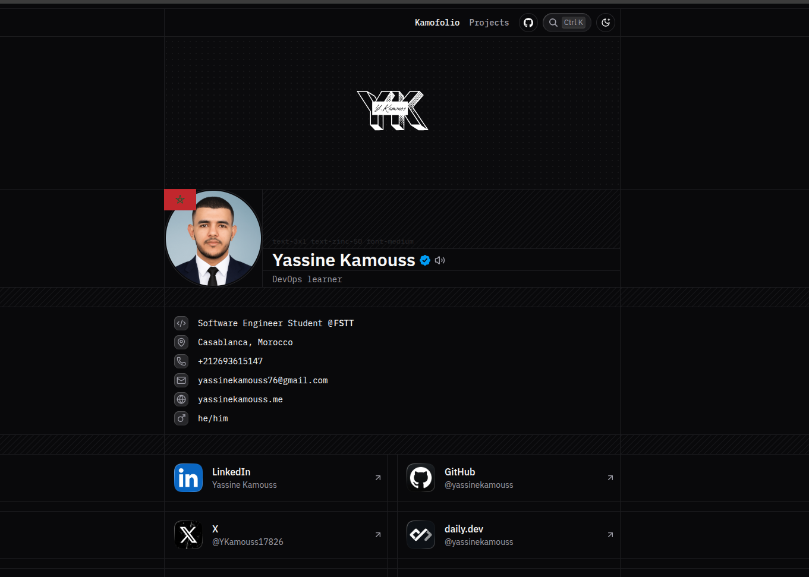

# Kamofolio – Yassine Kamouss Portfolio

A minimal, fast, and clean personal portfolio built with Next.js 15, React 19, TypeScript, Tailwind CSS 4, and shadcn UI. It showcases my profile, projects, experience, certifications, and more.

- Live site: https://yassinekamouss.me
- Tech: Next.js App Router, React Server Components, Tailwind CSS, Radix UI, shadcn UI, TypeScript
- Status: Actively maintained. Blog removed — portfolio focuses on projects and profile pages.

## 📸 Screenshot



## ✨ Features

- Modern Next.js 15 (App Router) with React 19
- TypeScript-first, strict linting and formatting
- Tailwind CSS 4 with custom design system and components
- Accessible UI primitives via Radix + shadcn UI
- Responsive design, dark mode, and polished micro-interactions
- SEO basics: robots.txt and sitemap.xml
- Projects page at `/projects` and a rich home page with multiple sections

## 🧰 Tech Stack

- Framework: Next.js 15 (App Router)
- UI: React 19, Tailwind CSS 4, Radix UI, shadcn UI
- Forms & State: React Hook Form, Jotai
- Content/MDX: next-mdx-remote (infra in place)
- Utilities: dayjs, clsx, class-variance-authority, zod
- Tooling: TypeScript 5, ESLint, Prettier, pnpm

> See `package.json` for exact versions.

## 🚀 Getting Started

Prerequisites:
- Node.js 20+ (or >=22)
- pnpm 9+ (the repo uses pnpm 10.x)

Install dependencies:

```bash
pnpm install
```

Start the dev server (Turbopack):

```bash
pnpm dev
```

Build for production:

```bash
pnpm build
```

Start the production server:

```bash
pnpm start
```

## 📁 Project Structure (high level)

```
src/
  app/
    (app)/
      (root)/page.tsx        # Home page with sections (Overview, Projects, etc.)
      (docs)/projects/       # Projects listing page
    layout.tsx               # Root metadata and providers
    robots.ts                # robots.txt
    sitemap.ts               # sitemap.xml generator (no blog)
  components/                # Reusable UI components
  features/profile/          # Feature modules for profile sections
  lib/                       # Utilities, fonts, helpers
  styles/                    # Global styles (Tailwind)
public/
  screen.png                 # Screenshot used in README
```

## 🔧 Scripts

- `pnpm dev` — Run dev server on port 1408 (Turbopack)
- `pnpm build` — Production build
- `pnpm start` — Start production server
- `pnpm preview` — Build and start on port 1408
- `pnpm lint` / `pnpm lint:fix` — Lint code
- `pnpm check-types` — Type-check TypeScript
- `pnpm format:write` — Format source code

## 🔎 SEO & Metadata

- `src/app/robots.ts` generates a robots.txt referencing the sitemap.
- `src/app/sitemap.ts` returns URLs for `/` and `/projects` (no blog entries).
- Global metadata is defined in `src/app/layout.tsx`.

## ⚙️ Configuration

- Site information is centralized in `src/config/site.ts`.
- Set `APP_URL` in environment to override the default site URL used for metadata and sitemap.

## 🛳️ Deployment

- Optimized for platforms like Vercel. Build with `pnpm build` and serve with `pnpm start`.

## 📄 License

MIT © Yassine Kamouss

## 🙌 Acknowledgements

- [Next.js](https://nextjs.org/)
- [Tailwind CSS](https://tailwindcss.com/)
- [Radix UI](https://www.radix-ui.com/)
- [shadcn UI](https://ui.shadcn.com/)
